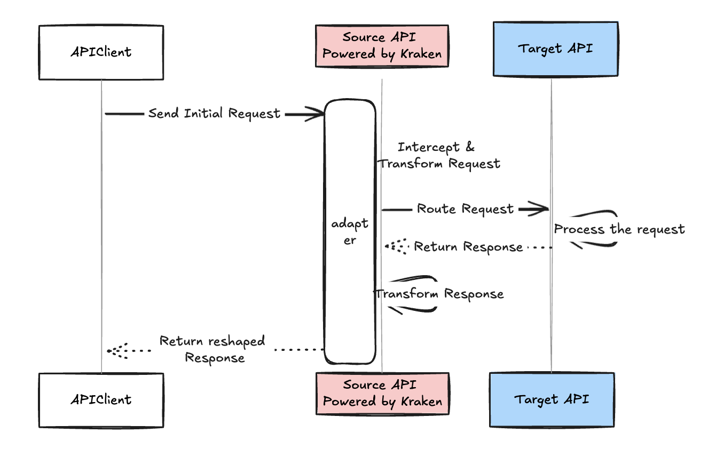
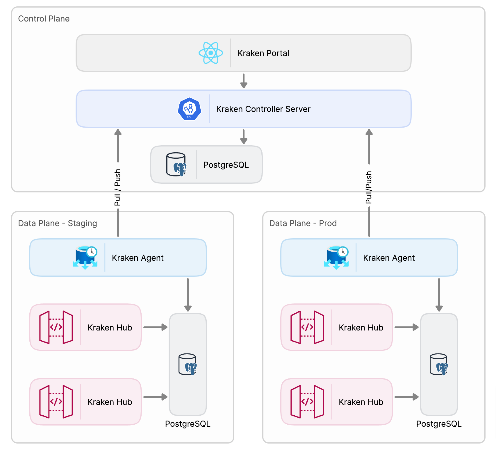

# Kraken

## Overview

Kraken is a comprehensive API mapping solution designed to bridge the gap between disparate APIs with varying data structures, enabling seamless communication between systems. It focuses on mapping non-standard or legacy APIs to standardized interfaces, simplifying integration and ensuring interoperability between business systems.


## Core Functionalities
At its heart, Kraken is an API mapping engine. It facilitates communication between a source API (like Sonata API) and a target API (such as proprietary or non-standard seller APIs) by transforming and mapping their data structures. The engine essentially acts as a adapter layer that abstracts the differences between APIs, allowing them to communicate without the need for significant redevelopment.

## Key Features
- **Mapping Flexibility**: Users can create mappings between a source Endpoint and a target Endpoint and mapping their request and response properties, allowing data from one API format to be converted and routed to the corresponding fields in another API.
- **Target API Setup**: The interface also provides functionality to configure the taget API server. This is essential for integrating APIs that have not yet been standardized or exposed to the platform. Users can upload the configuration of the target API and set it up for smooth interaction.
- **API activity tracking**: All the API calls to Source API through Kraken will be captured for future debugging and analysis

## Benefits
- **Simplified API Integration**: By abstracting the complexity of different API structures, the solution reduces the development effort required to integrate APIs, offering a plug-and-play model.
- **Flexibility**: The tool supports a wide range of API mappings, allowing for customization and specific configurations depending on the API needs.
- **Monitoring and Analytics**: The platform offers monitoring capabilities to track API performance and ensure data is flowing as expected.


## Architecture

Kraken follows a modular architecture, comprising several components that work together to deliver its functionality:


- **Control Plane**: This layer is responsible for the configuration and management of API mappings. Users interact with this layer to define, map, and deploy APIs.
- **Data Plane**: The data plane handles the actual data flow, ensuring that requests and responses are properly mapped and delivered between the source and target API Servers.

### Key Components

- **Kraken Hub**: Kraken Hub acts as a high-performance Ingress Controller, efficiently routing external traffic to services within your infrastructure. It seamlessly integrates with your existing network infrastructure, providing a reliable entry point for incoming requests.

- **Kraken Agent**: Sync all hub's activities to controller server and pull latest configuration from controller server.

- **Kraken Controller**: Customize API mapping rules, manage mapping versions and release mappings to data plane.

- **Kraken Portal**: Management Portal.

## Get Started

To begin, clone the repository and navigate to the project directory:

```console
git clone https://github.com/mycloudnexus/kraken.git
cd kraken
```

### Run via docker

The simplest way to get Kraken up and running is with Docker. Follow these steps:

1. Navigate to the docker directory:

```
cd docker
```

2. Start the services using Docker Compose:
```
docker-compose up
```

If all services start correctly, the following servers will be accessible(The default login is **admin/admin**):

- Portal: http://localhost:3000
- Controller: http://localhost:8001
- Hub: http://localhost:8000
- Agent: http://localhost:8002


### Run via Source Code

For a more customizable setup, you can compile and run the project from the source code. Ensure the following prerequisites are installed:

#### Prerequisites

Before compile the source code, ensure you have the following prerequisites:

- [Maven] (https://maven.apache.org)
- [JDK 17 or later](https://openjdk.org/)
- NodeJS 20 or later (https://nodejs.org/en)
- NPM

You can verify the installed versions with the following commands:

```
1. mvn -v
2. java -version
3. node -v
4. npm -v
```


#### Step 1 - Run the Control Portal

1. From the base of the repository, navigate to the portal directory:
```
cd kraken-app/kraken-app-portal
```
2. Install the dependencies and start the development server:
```
npm install
npm run dev
```

3. Open the portal in your browser at [http://localhost:5173](http://localhost:5173).  
   > **Note**: You will not be able to log in yet as the API server is not running. The default login is **admin/admin**.


#### Step 2 - Run the Control API Server

The Control API Server relies on a PostgreSQL database. You can set up a PostgreSQL server using Docker:

1. **Start PostgreSQL** using Docker Compose:

   ```bash
   cd docker
   docker-compose up db-control-plane
   ```

   Alternatively, you can set up PostgreSQL manually based on your environment's requirements.

2. **Compile the source code**:

   ```bash
   mvn package -DskipTests
   ```

3. **Set up environment variables**:

   ```bash
   export DB_URL=jdbc:postgresql://localhost:5432/kraken-mgmt
   export DB_USERNAME=postgresql
   export DB_PASSWORD=password
   ```

4. **Run the Control API Server**:

   ```bash
   java -jar kraken-app/kraken-app-controller/target/*.jar
   ```

5. Access the Swagger UI at [http://localhost:8001](http://localhost:8001).  
   You should now be able to log into the portal at [http://localhost:5173](http://localhost:5173) using the default credentials **admin/admin**.

#### Step 3 (Optional): Run Data Plane API Servers

If you want to test the data plane features, you can run the Hub and Agent API servers as follows:

1. **Set up environment variables** for both servers:

   ```bash
   export DB_URL=jdbc:postgresql://localhost:5432/kraken
   export DB_USERNAME=postgresql
   export DB_PASSWORD=password
   ```

2. **Run the Hub API Server**:

   ```bash
   java -jar kraken-app/kraken-app-hub/target/*.jar
   ```

3. **Run the Agent API Server**:

   ```bash
   java -jar kraken-app/kraken-app-agent/target/*.jar
   ```

4. Access the Hub’s Swagger UI at [http://localhost:8000](http://localhost:8000).

---

#### Troubleshooting

- **Database Connectivity**: Ensure that the PostgreSQL instance is running and the connection details (`DB_URL`, `DB_USERNAME`, and `DB_PASSWORD`) are correctly set.
- **Port Conflicts**: If any of the ports are already in use, you can modify them in the `docker-compose.yml` file or the respective configuration files.

### Code Structure
```
kraken/
│
├── kraken-app/
│   └── kraken-app-controller/
│   │   └── src
│   │   │   └── main
│   │   │   └── test
│   │   └── pom.xml
│   └── kraken-app-agent/
│   └── kraken-app-hub/
│   └── kraken-app-portal/
│   └── pom.xml
│
├── kraken-java-sdk/
│   └── kraken-java-sdk-core/
│   │   └── src
│   │   │   └── main
│   │   │   └── test
│   │   └── pom.xml
│   └── kraken-java-sdk-auth/
│   └── kraken-java-sdk-controller/
│   └── kraken-java-sdk-sync/
│   └── kraken-java-sdk-gateway/
│   └── kraken-java-sdk-mef/
│   └── kraken-java-sdk-test/
│   └── pom.xml
│
├── docs/
│   └── developer_guide.md
│   └── configuration.md│
│
├── .github/
│   ├── workflows/
│   │   └── ci.yml
│   ├── ISSUE_TEMPLATE/
│   │   └── bug_report.md
│   │   └── feature_request.md
│   ├── PULL_REQUEST_TEMPLATE.md
│   └── CODE_OF_CONDUCT.md
│
├── .mvn/
│   └──jvm.config
│
├── docker/
│   ├── app-controller/
│   │   └── application-default.yaml
│   │   └── Dockerfile
│   ├── app-hub/
│   ├── app-agent/
│   ├── app-portal/
│   ├── docker-compose.yaml
│
├── README.md
├── CONTRIBUTING.md
├── LICENSE.md
├── CHANGELOG.md
├── pom.xml
└── .gitignore

```

### Configuration

The behavior of the Kraken can be customized using command-line arguments or environment variables. Refer to the [Configuration](./docs/configuration.md) documentation for a list of available options and their descriptions.


## Contributing

We welcome contributions from the community! If you'd like to contribute to the Kraken project, please follow our [Contribution Guidelines](./CONTRIBUTING.md).

## Coding Standards

This project follows the [Google Java Style Guide](https://google.github.io/styleguide/javaguide.html) for coding conventions. Please ensure that your code adheres to these standards before submitting a pull request.

## License

This project is licensed under the [Apache 2.0](./LICENSE).
