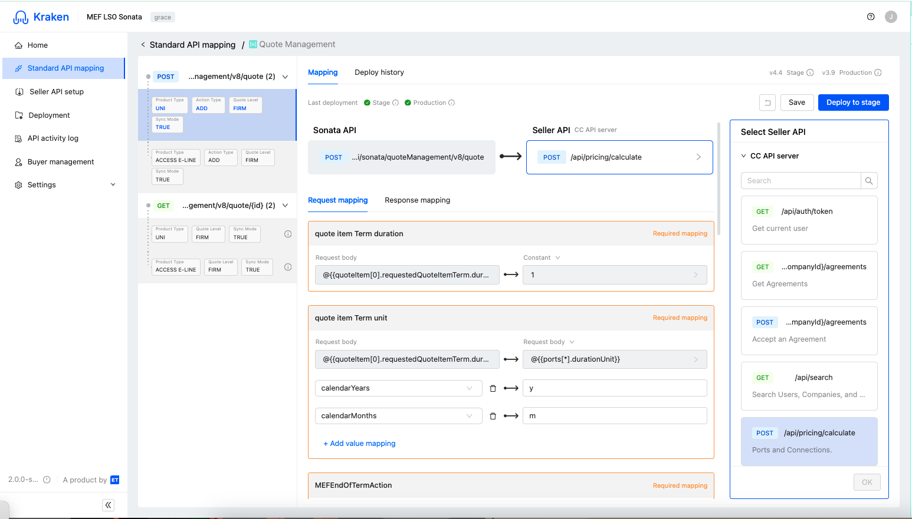
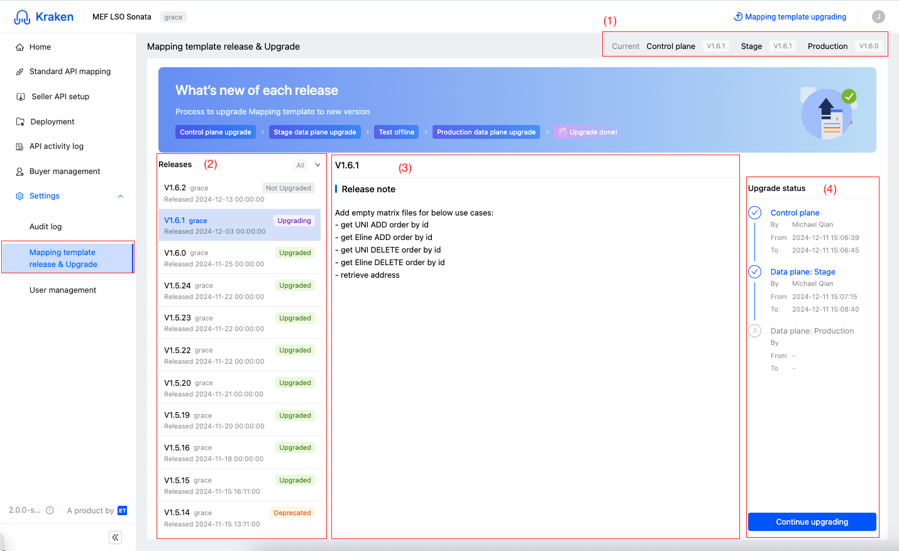
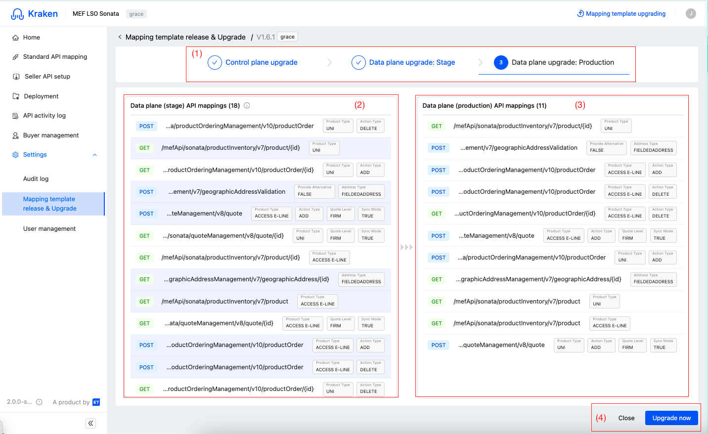
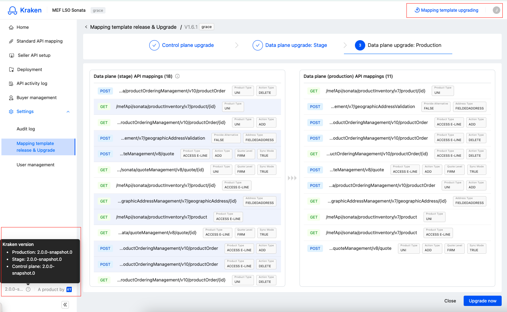

## Table of Contents
1. [Bootstrapping](#bootstrapping)
2. [Running on local machine](#running-on-local-machine)
3. [Pushing, Reviewing & Merging](#pushing-reviewing--merging)
4. [Folder structure](#folder-structure)
5. [Screens](#screens)
    1. [Home](#home)
    2. [Standard API mapping](#standard-api-mapping)
    3. [Seller API setup](#seller-api-setup)
    4. [Deployment](#deployment)
    5. [API activity log](#api-activity-log)
    6. [Buyer management](#buyer-management)
    7. [Audit log](#audit-log)
    8. [Mapping template release & upgrade](#mapping-template-release--upgrade)
    9. [User management](#user-management)

## Bootstrapping
- [Vite](https://vite.dev/config/)
- [Vitest](https://vitest.dev/config/)
- [Tanstack/react-query](https://tanstack.com/query/v5/docs/framework/react/overview)
- [zustand](https://zustand-demo.pmnd.rs/)
- [recharts](https://recharts.org/en-US/)
- [Ant Design](https://ant.design/)

## Running on local machine
```bash
cd kraken-app/kraken-app-portal

npm install

npm run dev

npm run test
```

## Pushing, Reviewing & Merging
Main branch: ```main```

Refer to ```.github/PULL_REQUEST_TEMPLATE.md``` files and following committing rules, PR title, etc...

SonarQuebe quality check pass:
- Less than or equal to 1 accepted issue.
- No `vulnerabilities` with medium or higher severity were found.
- Code coverage passed at rate `>= 80%`

- Needs `2 approvements`


## Folder structure

```
kraken
|
+- kraken_app
|   |
|   +- kraken_app_portal
|   |   |
|   |   +- src
|   |   |   |
|   |   |   +- __mocks__: Contains all api mock files, to support 
|   |   |               integration testings
|   |   |   +- __tests__: Contains all test files
|   |   |   +- assets: Contains all assets files, images, svgs, etc...
|   |   |   +- components: Custom/shared components used throughout project
|   |   |   +- hooks: Custom react hooks
|   |   |   +- libs: Contains utilities functions to handle date time, etc...
|   |   |   +- pages: Contains all screen components
|   |   |   +- router: Configures app routes
|   |   |   +- services: Contains all tanstack/react-query hooks for
|   |   |                handling api requests
|   |   |   +- stores: Contains zustand stores, used for some specific 
|   |   |               screens as state managements
|   |   |   +- .env: Development environment file
|   |   |   +- package.json: Contains information about project, and all depenedencies
|   |   |   +- package-lock.json
|   |   |   +- vite.config.ts: Configures Vite
|   |   |   +- vitest.config.ts: Configure Vitest
+- sonar-project.properties: Contains configuration for sonar cloud to run code coverage on certain files filters
```

## Screens


### Home

Figma link: [Home page](https://www.figma.com/design/7226ko3yz2LYVznVrjLGkv/Kraken-control-plane-UX-Design?node-id=5373-11547&m=dev)

### Standard API Mapping



Functional:

### Seller API setup

Functional:

- Allows sellers to create a seller API by providing information, mapping url, swagger file (.yaml)


### Deployment

Functional:

- Lists all API mapping statuses, deployment history

### API activity log

Functional:


### Buyer management


### Audit log


### Mapping template release & upgrade

Figma link: [Upgrade mapping template](https://www.figma.com/design/7226ko3yz2LYVznVrjLGkv/Kraken-control-plane-UX-Design?node-id=4964-45536&m=dev)

Source files: `kraken-app/kraken-app-portal/src/pages/MappingTemplate`

Functional:


- (1): Shows 3 versions of control plane, stage and product. Related api `/system-info`. Corresponding fields `controlProductVersion`, `stageProductVersion`, `productionProductVersion` respectively.

- (2): Lists all upgrade versions, including version name, product spec, upgrade status, and published date. Can be filted by upgrade status, scroll down to load more.

- (3): Shows details of an upgrade version. Data shown regards to selected version on left panel (2).

- (4): Shows upgrade process, order sequentially by `Control plane`, `Data plane: Stage`, and `Data plane: Production` upgrades. Each stage can have 3 statuses: `Not upgraded`, `Upgrading` and `Upgraded`. The `Continue upgrading` button is shown when the upgrading is proceeding. `Start upgrading` when no upgrades were made. When upgrade is done, it can be view-only.




- (1): Shows correspond step which upgrade is currently at

- (2): current upgrade stage. Every upgradeable api use cases will be highlighted in primary color (only applicable in stage and production upgrade), click on any will jump to corresponding Standard API Mapping page.

- (3): target upgrade stage, which the use cases will be transformed to

- (4): `Cancel` or `Upgrade now` button. Click on Cancel to back to landing page. Click on Upgrade now to start upgrading, disabled when a upgrade is still running.
- Mapping icon will animate when a upgrade is proceeding. All errors or related notifications will show above section (2) and (3)


### User management


### Displaying system info & running template mapping

Figma link: [System info](https://www.figma.com/design/7226ko3yz2LYVznVrjLGkv/Kraken-control-plane-UX-Design?node-id=5545-40685&m=dev)



- Shows system info at bottom corner of left side menu, whose data is derived from `/system-info` api.

- When a mapping template is upgrading, show `Mapping template upgrading` mark at top bar, next to user menu.