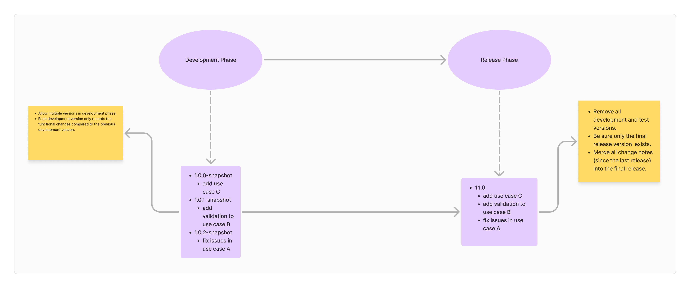
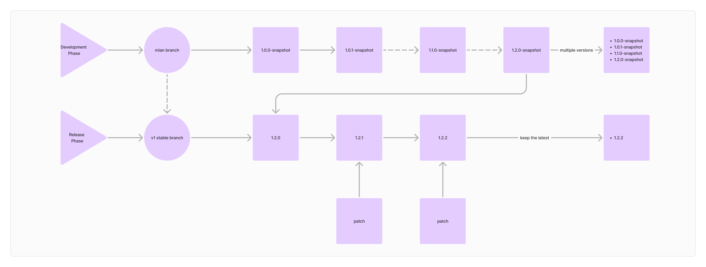

# Mapping template upgrade guide

## Workflow of mapping template release



### Development phase

* Allow multiple versions in development phase.
* Each development version only records the functional changes compared to the previous development version.

### Release phase

* Create the final release version.
* Merge all change notes (since the last release) into the final release.
* Remove all development and test versions in directory of mef-sonata/template-upgrade.

## Mapping Template Version Naming Convention

### Version Pattern

{Major}.{Minor}.{Patch}

* Major
  * Arabic numerals
  * Consistent with the major version of the Kraken application
* Minor
  * Arabic numerals
* Patch
  * Letters or numbers

### Version naming convention

#### Development phase

* version ends with suffix snapshot,for example
  * 1.0.1-snapshot
  * 1.2.0-snapshot

#### Release phase

Version should not contain letters,for example

* 1.6.0
* 1.6.1
* 2.0.0

The following picture explains the rules for version number changes during the development and release phases.

## When to add a new mapping template release

* Add API Use Case
* Modify existed API Use Case
  * Modify user mapping template
  * Modify mapping target file
  * Modify API orchestration file
  * Modify API request validation rule file
* Other changes
  * Add/Modify  API spec file
  * Add/Modify open API spec of supported product

## How to create a mapping template release

1. Create a mapping template release file(e.g. release.1.5.13.yaml)  under directory of mef-sonata/template-upgrade in the module of kraken-java-sdk-mef.

   Here show an example of mapping template release

   ```yaml
   ---
   kind: kraken.product.template-upgrade
   apiVersion: v1
   metadata:
     key: kraken.product.template-upgrade.1.5.13
     name: V1.5.13
     labels:
       productSpec: grace
       productVersion: V1.5.13
       publishDate: 2024-11-15
     description: |
       Make some improvements to order template:
         add itemTerm in add order template;
         add expectedCompletionDate in get order template;
     version: 1
   ```
   **Important fields explanation**

   * productSpec: Standard version of one product.Such as grace,haley in LSO SONATA.
   * productVersion: Release version of mapping template release.
   * publishDate: Release date of mapping template.
   * description: Description of all changes in the current release.
2. Add path of the release file to mef-sonata/product.yaml

   ```yaml
   spec:
     componentPaths:
       - classpath:/mef-sonata/template-upgrade/release.1.5.13.yaml
   ```
